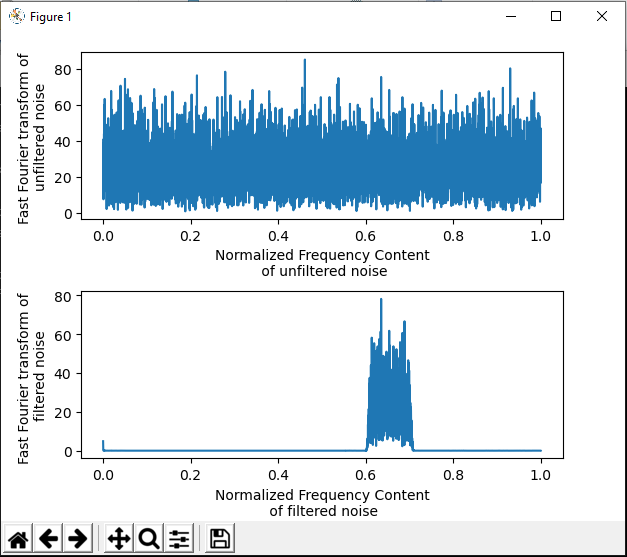

# High Frequency Noise Generation

### This Repository contains source code of high frequency noise generation (High frequency means with respect to Sampling Frequency).It is written in C.

### How  it works
* At first stage we design a bandpass filter which have order of 419 using Matlab by createBandpassFilterCoeff.m script and export filter coefficient into a text file ("bpf_coeff.txt")  in /filter directory (More about filter can be found in filter generaton script).
* Then we generate a random signal which have nearly all frequency content using main.c file and load filter kernel ("bpf_coeff.txt").
* After that we convolve noise with filter then we get filtered noise and export both noise and filtered noise into /data directory.
* Then we use python to plot both frequency content of filtered and unfiltered noise by matplotlib.

### Usage
* to build type in cmd 
```
make run
```
or import files into your IDE and compile main.c file.

* to plot type make plot
```
make plot
```
or compile plot .py with python.

### Example Output


### Dependencies
*   Numpy
*   Matplotlib
